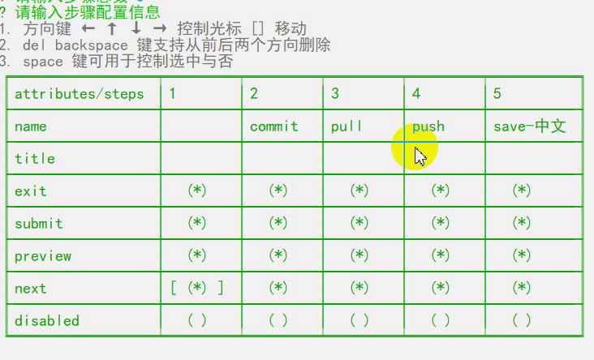

#inquirer-table-insert-prompt


## Installation
---
```
npm install inquirer-table-insert-prompt
```

## Usage



After registering the prompt, set any question to have type: "table" to make use of this prompt.

The result will be an array, containing the value for each row.

```
const { validator, required, filename } = require('inquirer-table-insert-prompt/validator')
inquirer.registerPrompt("table", require('inquirer-table-insert-prompt'))

inquirer
  .prompt([
    {
      type: 'table',
      name: 'process',
      message: '请输入步骤配置信息',
      columns: [1,2,3,4],
      rows: [
        {
          name: 'name',
          validate: validator(required, filename)
        },
        {
          name: 'title'
        },
        {
          name: 'exit',
          type: Boolean,
          default: true
        },
        {
          name: 'submit',
          type: Boolean,
          default: true
        },
        {
          name: 'preview',
          type: Boolean,
          default: true
        },
        {
          name: 'next',
          type: Boolean,
          default: true
        },
        {
          name: 'disabled',
          type: Boolean,
          default: false
        }
      ]
    }
  ])
  .then((answers) => {
    console.info(answers)
  })
  .catch((error) => {
    if (error.isTtyError) {
      // Prompt couldn't be rendered in the current environment
    } else {
      // Something else went wrong
    }
  });

```

## Options
---

- columns: Array of options to display as columns. supposed to be as the flow formmats
  - ['a', 'b', 'c']
  - [ { name: 'a', value: 'A' }, { name: 'b', value: 'B' } ]
  - [ { name: 'a', value: 'A' }, 'b', { name: 'c', value: 'C' }, 'd' ]
- rows: Array of options to display as rows. 
  - name: is required
  - type: now only supported Boolean and default
  - default: cell's default value


### Abount Validator 
---
validator is a currying function, it can be accept lots of params to validate value, you can defined yourself vaildate function as inquirer's validate function

```
  required  isNumber isInt filename IntRange
```
